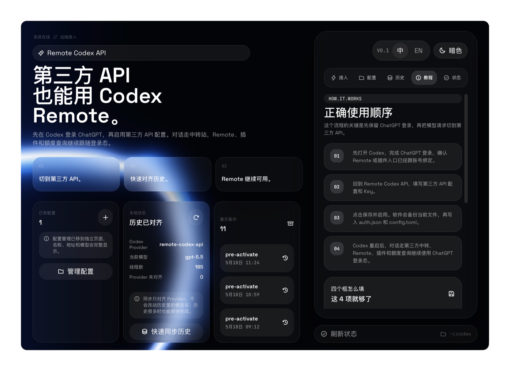

# Remote Codex API

让使用第三方 API 的用户，也能继续使用 Codex Remote、插件、额度查询和本地历史。



Remote Codex API 是一个轻量桌面托盘工具。它不会注入 Codex UI，也不会修改已安装的 Codex App，只负责管理第三方 Provider 配置、保留 ChatGPT 登录态、快速同步本地历史可见性，并在需要时打开或重启 Codex。

## 交流群

扫码加入交流群，交流第三方 API、Codex Remote、Codex Manager、本地历史同步和跨平台使用问题。


当前二维码有效期至 2026-05-25，过期后会在仓库里更新。

## 友情链接

- [LINUX DO](https://linux.do/)：很有活力的开发者社区，本项目也欢迎来自 LINUX DO 的佬友交流和监督。
- [Codex Mate](https://github.com/serein431/Codex-Mate)：偏桌面增强的 Codex 伴侣工具，适合需要启动器、辅助菜单和 Codex UI 增强的场景。

## 为什么做这个

很多人使用第三方 API 或本地中转站来跑 Codex 对话，但 Codex Mobile、Remote、插件和额度查询这些能力又依赖 ChatGPT 登录态。手动改配置可以做到“账号继续登录 ChatGPT，对话请求走第三方 API”，但过程很容易写错，也不方便在多个 Provider 之间切换。

Remote Codex API 把这件事做成一个可视化工具：

- 先让用户在 Codex 里完成 ChatGPT 登录。
- 再启用第三方 API 配置。
- Codex 继续保留账号登录态，Remote 和插件入口不掉。
- 实际模型请求切到用户选择的第三方 API。
- 切换 Provider 后，可以用很轻量的方式恢复本地历史在侧边栏里的可见性。

## Mobile / Remote 体验

配置完成后，Codex Mobile 侧的 Remote 连接流程仍然可以继续使用 ChatGPT 登录态完成安全设置；模型请求则走你在桌面端启用的第三方 API 或本地中转。


## 它和 Codex Mate 的区别

Codex Mate 是更重的 Codex 桌面增强工具：它会启动 Codex、开启调试端口、运行 helper server，并通过 renderer injection 做 UI 增强。

Remote Codex API 更轻，只做 Provider 与历史管理：

- 不注入 Codex 前端页面。
- 不修改 Codex App 安装包。
- 不接管 Codex 的主界面。
- 不做云端跨账号迁移。
- 专注于第三方 API 切换、ChatGPT 登录态保留、本地历史同步和 WSL/自定义目录补充。

如果你只需要“第三方 API 也能用 Codex Remote”，用 Remote Codex API 会更直接；如果你需要 Codex 桌面增强和额外 UI 能力，再考虑 Codex Mate。

## 和 Codex Manager 一起使用

Remote Codex API 可以和 Codex Manager 一起使用。推荐分工是：

- Codex Manager 继续作为本地模型网关、路由器或中转服务。
- Remote Codex API 负责把 Codex 保持在 ChatGPT 登录态，同时把当前 Provider 指向 Codex Manager 暴露的 OpenAI 兼容地址。
- Remote Codex API 继续负责本地历史 Provider 对齐、备份和恢复。

例如 Codex Manager 在本机提供 OpenAI 兼容接口时，可以把 Remote Codex API 的 API 地址填成本地 `/v1` 地址。遇到代理软件时，建议优先使用 `127.0.0.1`，并确保代理工具不会劫持本地网关流量。

## 核心功能

- Provider 配置管理：保存多个第三方 API 配置，一键保存并启用。
- 系统钥匙串存 Key：Provider token 存在 macOS Keychain 或 Windows Credential Manager。
- ChatGPT 登录态保留：激活时保持 Codex 的 ChatGPT 登录模式。
- 稳定 Provider 桶：Codex 内部固定使用 `remote-codex-api`，切换配置时只更新当前桶的运行参数。
- 历史快速同步：只对齐 Provider 元数据和索引，不重写大段聊天内容。
- 自定义历史目录：适合 Windows + WSL、外置工作区、多 Codex home 场景。
- 自动备份与恢复：写入 Codex 配置和历史索引前先备份。
- 托盘操作：打开面板、同步历史、打开 Codex、退出。
- macOS / Windows：首发支持两个桌面平台。

## 工作原理

Codex 本地状态可以粗略分成两条链路：账号登录态和模型请求 Provider。

账号登录态由 Codex 的认证文件维护。用户先在 Codex 里登录 ChatGPT，Remote Codex API 激活配置时会让 Codex 继续处在 ChatGPT 登录模式，并清空本地 API Key 字段。这样 Codex Remote、插件入口、额度查询等能力仍然跟随 ChatGPT 登录态。

模型请求由 Codex 的 Provider 配置决定。Remote Codex API 会固定使用一个内部 Provider：`remote-codex-api`。用户切换不同配置时，Codex 看到的 Provider 名称保持稳定，实际的供应商名称、模型、鉴权 token 等会更新为当前选中的第三方 API。

所以关键点是：登录态继续走 ChatGPT，模型请求走第三方 API。两者同时成立时，就能在保留 Remote / 插件能力的同时，让对话消耗第三方中转。

## 历史同步原理

Codex 本地历史不只是一堆聊天文件，还包含 SQLite 数据库、rollout 会话文件、`session_index.jsonl` 和全局状态。切换账号或 Provider 后，旧会话可能还标着旧 Provider，于是侧边栏看起来像“历史没了”。

Remote Codex API 的同步不搬运聊天内容，也不改历史里的模型名。它只做几件轻量操作：

- 把线程数据库里的 Provider 对齐到当前 Provider 桶。
- 把 rollout 首行元数据里的 Provider 对齐到当前 Provider 桶。
- 重建或合并本地会话索引。
- 修复 Codex 的项目根状态，让真实存在的 session 重新可见。
- 跳过没有真实会话文件的空线程，避免同步出一堆空项目。

因为不扫描和重写整段对话内容，历史很多时也能保持很快。

## 使用方式

1. 先打开 Codex，完成 ChatGPT 登录，确认 Remote 或插件入口已经跟账号绑定。
2. 打开 Remote Codex API，进入配置页。
3. 新建配置，只填四项：配置名称、API 地址、模型、API Key。
4. 点击“保存并启用”。软件会备份当前 Codex 状态，再写入必要配置。
5. Codex 重启后，对话走第三方 API，Remote、插件和额度查询继续使用 ChatGPT 登录态。
6. 如果历史不显示，进入历史页点击快速同步；Windows + WSL 用户可以手动添加自定义历史目录。

注意：Provider token 平时存放在系统凭据管理器里。但 Codex 当前运行时仍需要从自己的配置读取 bearer token，因此激活配置时，Remote Codex API 必须把当前 token 写入 Codex 配置。界面和日志会脱敏显示。

## 平台支持

首发支持：

- macOS
- Windows

macOS 会检测常见的 Codex.app 安装位置，并通过系统方式打开。Windows 会检测常见安装目录，也支持通过系统启动方式兜底。历史目录支持用户手动添加，所以 Windows 用户可以补充 WSL 路径，例如 `\\wsl.localhost\Ubuntu\home\you\project`。

## 开发与构建

安装依赖：

```bash
npm install
```

启动开发模式：

```bash
npm run tauri dev
```

前端构建：

```bash
npm run build
```

Rust 测试：

```bash
cargo test
```

构建桌面应用：

```bash
npm run tauri:build:app
```

Windows 安装包需要在 Windows 环境构建，macOS 应用包需要在 macOS 环境构建。仓库 CI 会在 macOS 和 Windows 上分别跑测试与构建检查。

## 安全边界

- 不修改 Codex App 安装包。
- 不注入 Codex 页面。
- 不上传聊天记录。
- 不做云端跨账号迁移。
- `history_status` 只读。
- `history_sync` 和启用配置只写本机 Codex 状态。
- 每次激活配置前会创建备份。
- token 不会写入 Remote Codex API 自己的 Profile 文件。
